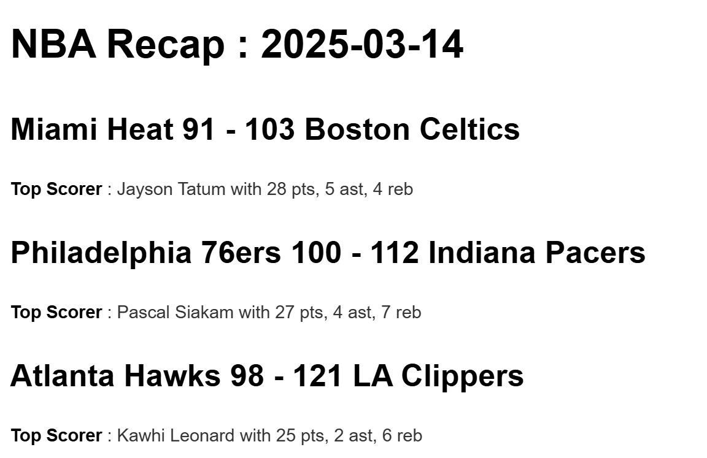

# NBA Daily Recap

Automated pipeline that fetches NBA game results every morning, stores them in a local SQLite database, and generates a Markdown report with scores and top performers for each game.

## How it works

The script fetches the previous day's NBA games via the [balldontlie API](https://github.com/balldontlie-api/python), stores the results in a SQLite database, and generates a `.md` report file. The entire pipeline is automated with GitHub Actions and runs every day at 9:00 AM UTC.

## Project structure

```
nba-recap/
├── .github/
│   └── workflows/
│       └── daily_recap.yml   # GitHub Actions workflow
├── main.py                   # Entry point
├── database.py               # SQLite init and insert logic
├── stats.py                  # Top scorer retrieval
├── report.py                 # Markdown report generation
├── requirements.txt
└── .gitignore
```

## Stack

- Python 3
- [balldontlie Python SDK](https://github.com/balldontlie-api/python) — NBA stats API wrapper
- SQLite — local storage for games and player stats
- GitHub Actions — daily automation

## Setup

**1. Clone the repository**
```bash
git clone https://github.com/SaberBerrehili/nba-recap.git
cd nba-recap
```

**2. Install dependencies**
```bash
pip install -r requirements.txt
```

**3. Configure your API key**

Create a `.env` file at the root:
```
API_KEY=your_balldontlie_api_key
```

Get your API key at [balldontlie.io](https://www.balldontlie.io).

**4. Run manually**
```bash
python main.py 2026-03-16
```

## Automation

The workflow runs every day at 9:00 AM UTC via GitHub Actions. It passes the previous day's date as an argument to `main.py` to account for the time difference with the US.

To use the automation on your own fork, add your API key as a GitHub Secret named `API_KEY` under Settings > Secrets and variables > Actions.

The workflow can also be triggered manually from the Actions tab using the `workflow_dispatch` event.


## Sample output

Below is an example of a generated recap file:




## Author

Saber Berrehili — [LinkedIn](https://www.linkedin.com/in/saber-berrehili/)
